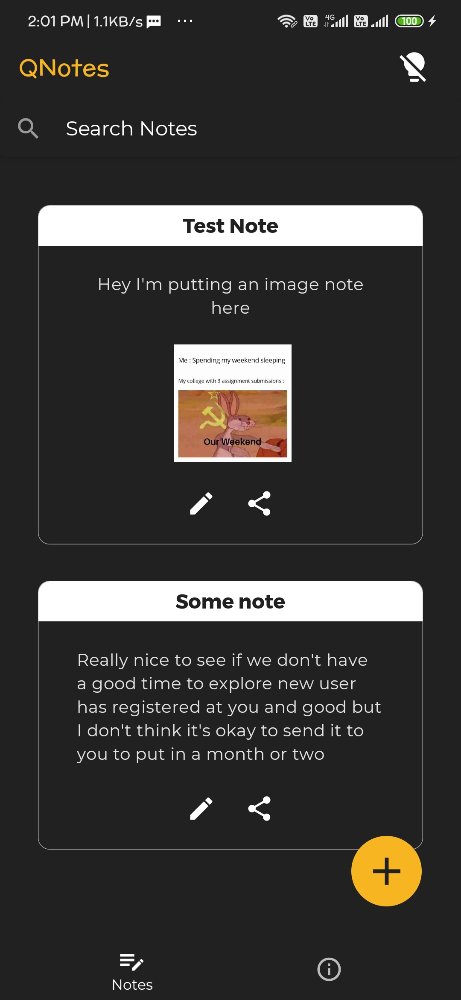

<h1 align="center" >QuickNotes</h1>
<h3 align="center">An App for making and storing notes</h3>

## Technologies used
React Native

### Screenies

  
  

### Installing depencencies and running the app
* Fork the repository
* Clone the repository
* Install the dependencies by `npm install`
* Run in Android by `npm run android`
* Run in IOS by `npm run ios`

 

### Author

#### [Adittya Dey](https://github.com/adiXcodr) ❤

<!-- "heroku-postbuild": "NPM_CONFIG_PRODUCTION=false npm install --prefix client && npm run build --prefix client" -->